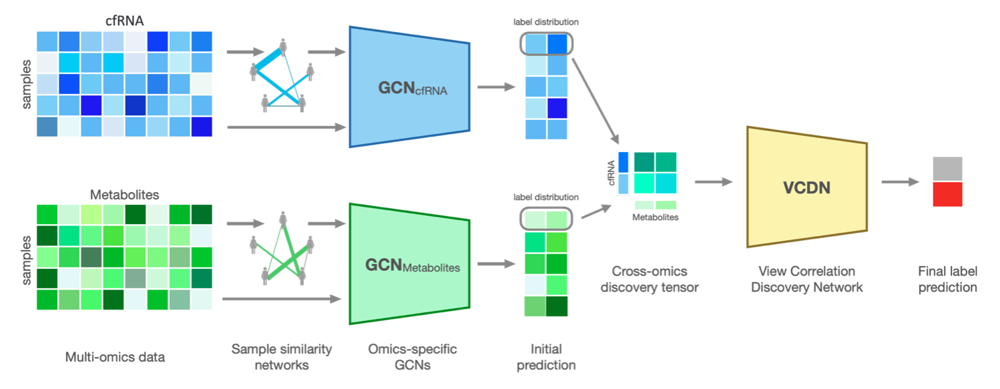
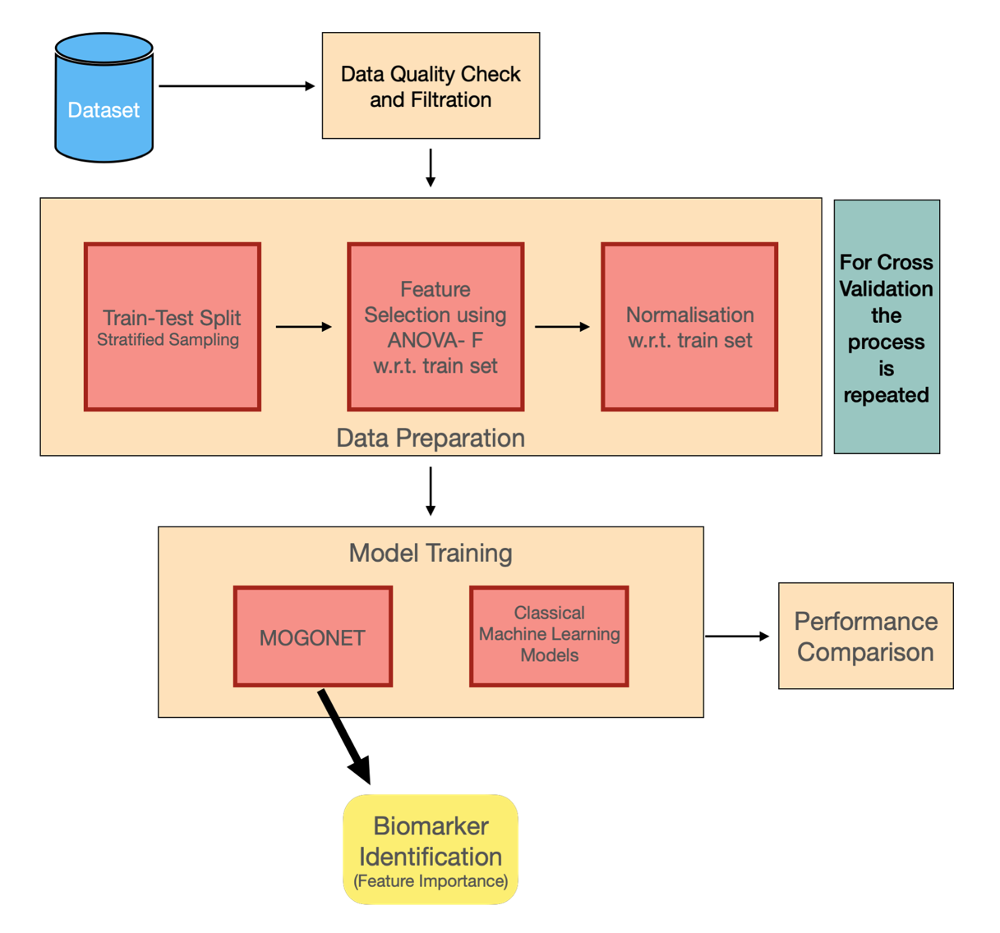

# Multi-Omic Data Analysis Pipeline with MOGONET

This repository contains a comprehensive pipeline for multi-omic data analysis, built upon the MOGONET framework. The pipeline includes preprocessing, classical machine learning model evaluation, and result aggregation to facilitate comparative analysis.

## Table of Contents

- [Introduction](#introduction)
- [Features](#features)
- [Pipeline Overview](#pipeline-overview)
- [Getting Started](#getting-started)
  - [Prerequisites](#prerequisites)
  - [Installation](#installation)
- [Usage](#usage)
- [Contributing](#contributing)
- [License](#license)
- [Contact](#contact)

## Introduction

Multi-omic data analysis involves integrating and analyzing multiple types of omics data to gain a holistic understanding of biological systems. This pipeline leverages the MOGONET framework to apply Graph Neural Networks (GNNs) for this purpose and includes additional components for preprocessing, classical ML model evaluation, and result aggregation. Its is adapted from the original MOGONET implementation by [Wang et al. (2021)](https://github.com/txWang/MOGONET.git). We have adpated for cfRNA and Metabolomics data.




## Features

- **Feature Selection and Preprocessing**: Automated feature selection and data preprocessing to ensure high-quality input for models.
- **Graph Neural Networks with MOGONET**: Advanced modeling using GNNs for multi-omic data.
- **Classical Machine Learning Models**: Baseline models for performance comparison.
- **Result Aggregation**: Comprehensive aggregation and comparison of model results.

## Pipeline Overview

The pipeline consists of the following main scripts:

1. **[preprocessing.py](preprocessing.py)**: Handles feature selection, data preprocessing, and train-test splitting.
2. **[mogonet.py](mogonet.py)**: Core script for training the MOGONET model.
3. **[cml.py](cml.py)**: Implements classical machine learning models for baseline performance.
4. **[result_aggregator.py](result_aggregator.py)**: Aggregates and compares results from classical ML and MOGONET models.
5. **[biomarker.py](biomarker.py)**: Identifies biomarkers from the MOGONET model.

The pipeline is designed to be modular, allowing users to easily customize and extend it for their own datasets and models.




## Getting Started

### Prerequisites

- Python 3.9
- Required Python packages (see `requirements.txt`)

### Installation

1. Clone the repository:
   ```bash
   git clone https://github.com/dnanad/mogonet_cml.git
   cd mogonet_cml
   ```

2. Install the required packages:
   ```bash
   pip install -r requirements.txt
   ```

3. Create a new folder `data` and create subfolders with numeric names (e.g. `1`, `2`,...) for each omic dataset. Also, create a folder `labels` for storing the labels.
IMPORTANT: Each subfolder should contain a CSV file with the omic data, and the `labels` folder should contain a CSV file with the labels. All these must have a common sample ID column to identify the samples.

## Usage

For step-step understanding of the pipeline, please refer to the [notebook](execute_step-by-step.ipynb).

```bash
python3 main.py --data_folder "0_new_data" \ #name of the folder containing the omic-data 
                --stratify \ #whether to stratify the data, if not then use --no_stratify
                --CV \ # whether to use cross-validation, if not then use --no_CV
                --n_splits 5 \ # number of splits for cross-validation in case of CV
                --num_epoch_pretrain 400 \ # number of epochs for pretraining
                --num_epoch 1200 \ # number of epochs for training
                --test_interval 50 \ # interval for testing
                --lr_e_pretrain 1e-3 \ # learning rate for encoder pretraining
                --lr_e 5e-3 \ # learning rate for encoder
                --lr_c 1e-3 \ # learning rate for classifier
                --num_class 2 \ # number of classes
                --adj_parameter 2 \ # adjacency matrix parameter
                --dim_he_list "[200, 200, 100]" # hidden layer dimensions
```


## Contributing

Contributions are welcome! Please open an issue or submit a pull request.

## License

This project is licensed under the MIT License. See the [LICENSE](LICENSE) file for details.

## Contact

For any questions or suggestions, please contact [ananddeshpande13@gmail.com](mailto:ananddeshpande13@gmail.com).